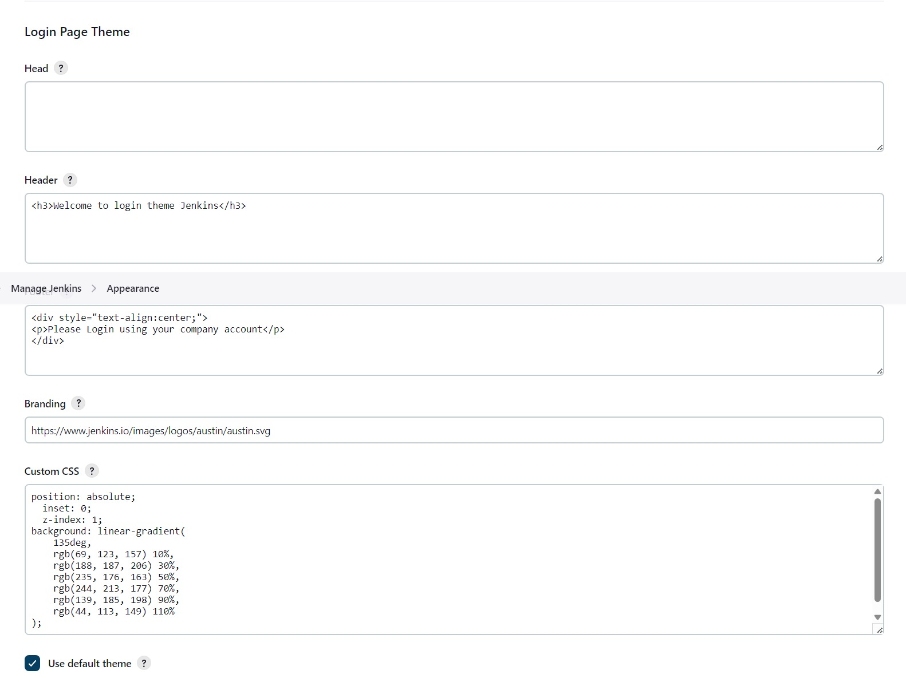
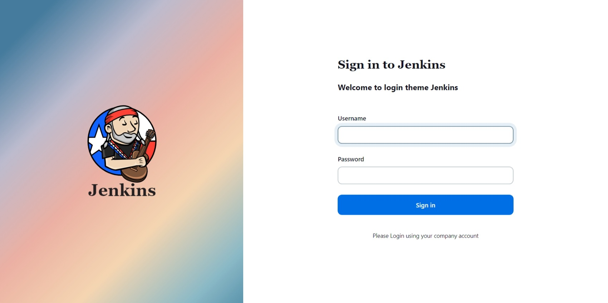

# Login Theme Plugin for Jenkins

[](https://plugins.jenkins.io/login-theme)
[](https://github.com/jenkinsci/login-theme-plugin/releases/latest)
[](https://plugins.jenkins.io/login-theme)

This plugin allows extending and overriding the default theme used on the login and signup pages on Jenkins

## Usage

After installation, its settings are available in *Manage Jenkins » Appearance » Login Page Theme*

Two modes are supported and controlled by the option *Use default theme*:

* If checked, it will extend the default theme with additional
content
* Otherwise, it will replace it entirely.

For example



## Result

Previous config will render login page customization



## Configuration as code

```
appearance:
  loginTheme:
    footer: 'The footer'
    head: ''
    header: '<h3>Welcome to login theme Jenkins</h3>'
    branding: 'Image Url'
    customCSS: ''
    useDefaultTheme: true
```

